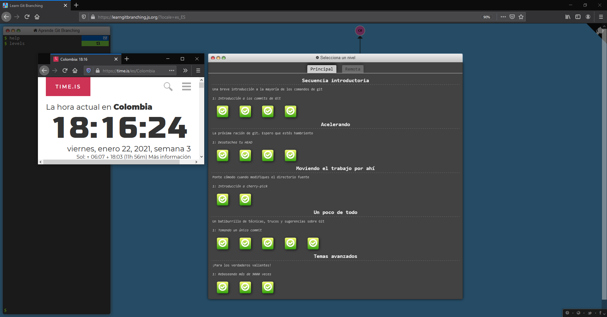
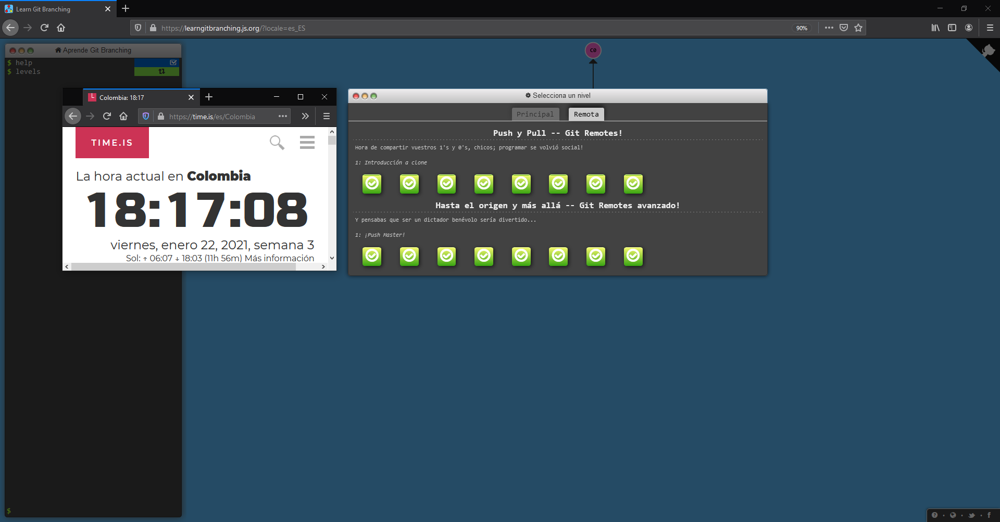

# ***Angie Tatiana Medina Gil***
## 1. Datos Basicos
* *Fecha de nacimiento:* 11/05/2001
* *Lugar de nacimiento:* Bogotá, Colombia
* *Institución educativa superior:* Escuela Colombiana de Ingenieria Julio Garavito
* *Plan de estudios:* Plan 14 de Ingenieria de Sistemas
* *Materias cursadas actualmente:*
    1. RECO
    2. CVDS
    3. AUPN
    4. FDGP
* *Correo de contacto:* angie.medina@mail.escuelaing.edu.co

## 2. Intereses
Entre las cosas que me llaman la atención se encuentran:
1. El desarrollo de videojuegos
El desarrollo de videojuegos es el proceso de creación de un videojuego, desde el concepto inicial hasta el videojuego en su versión final. Es una actividad multidisciplinaria, que involucra profesionales de la programación, diseño gráfico, animación, sonido, música, actuación, etc. 

2. La inteligencia artificial
La Inteligencia Artificial (IA) es la combinación de algoritmos planteados con el propósito de crear máquinas que presenten las mismas capacidades que el ser humano. Una tecnología que todavía nos resulta lejana y misteriosa, pero que desde hace unos años está presente en nuestro día a día a todas horas.

3. Programación competitiva
La programación competitiva conciste en competencias de programación donde se reta a los concursantes ha solucionar una serie de problemas en lenguajes de programación de manera eficiente.
en nuestro día a día a todas horas.


Actualmente poseo un repositorio de mis soluciones para los problemas de Uva: [SolucionesUva](https://github.com/AngieMeG/Uva-Online-Judge).
Aqui un ejemplo de mi solución para el problema [All in All](https://onlinejudge.org/index.php?option=onlinejudge&Itemid=8&page=show_problem&problem=1281): 
``` python
from sys import stdin as y


def main():
    line = y.readline().strip()
    while line:
        s, t = line.split()
        sizes, sizet = len(s), len(t)
        ps = 0
        for i in range(sizet):
            if s[ps] == t[i]: ps += 1
        print("Yes") if ps == sizes else print("No")
        line = y.readline().strip()


main()
```
## 3. GIT Branching
1. Main
* ***Nombre:*** Angie Medina
* ***Carné:*** 2160192

2. Remote
* ***Nombre:*** Angie Medina
* ***Carné:*** 2160192

