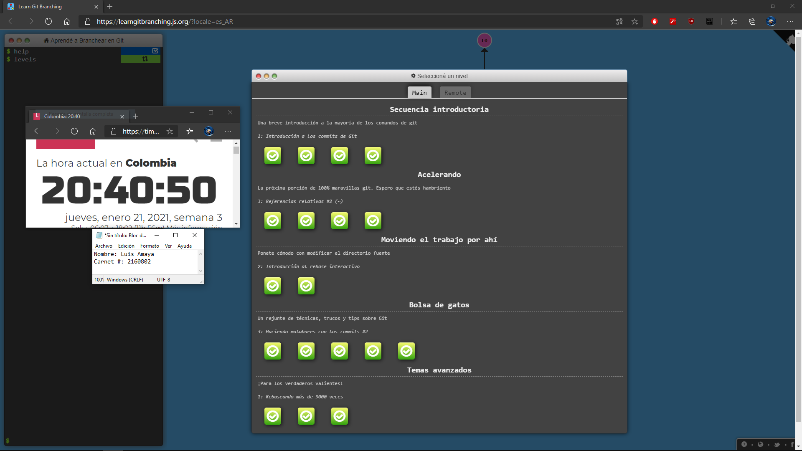
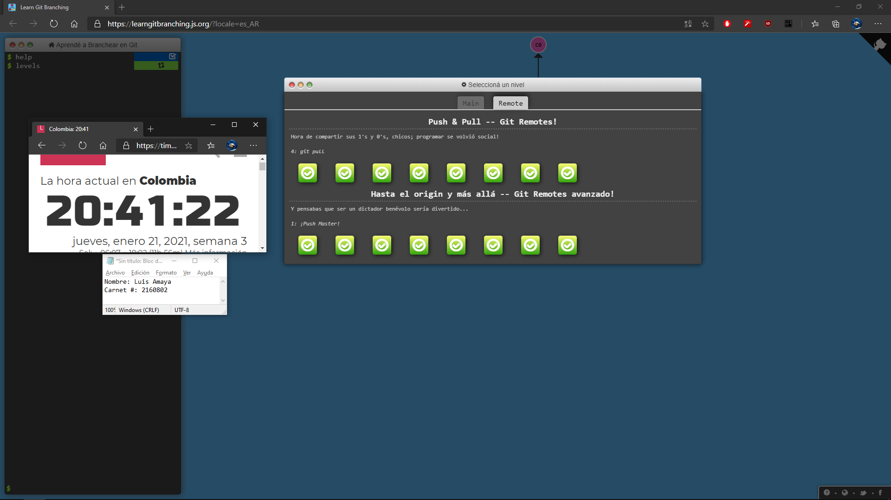

# Luis Amaya

## Datos Básicos
**Nombre**: _Luis Gerardo Amaya_
    Años: 20
    Plan de estudios: 14

### Hobbies
Mis mayores hobbies son:
-  [Videojuegos](https://es.wikipedia.org/wiki/Videojuego)
-  [Fútbol](https://es.wikipedia.org/wiki/F%C3%BAtbol)
-  Series

 Actualmente estudio en la Escuela Colombiana de ingeniería Julio Garavito ([ECI](https://www.escuelaing.edu.co/es/?version_escritorio=1))

## Materias Cursando Actualmente: 
Las materias que veo este semestre son:
1. RECO 
2. CVDS 
3. AUPN 
4. MATD 
5. GRAP 

 Mi equipo favortio de fútbol es el Real Madrid y como videojuego favorito no tengo alguno

![RealMadrid][1]

[1]: https://upload.wikimedia.org/wikipedia/en/5/56/Real_Madrid_CF.svg

Tambien me gusta programar y mi aspiración es algún día trabajar en desarrollo de software o de videojuegos.
> print("I love programming")

